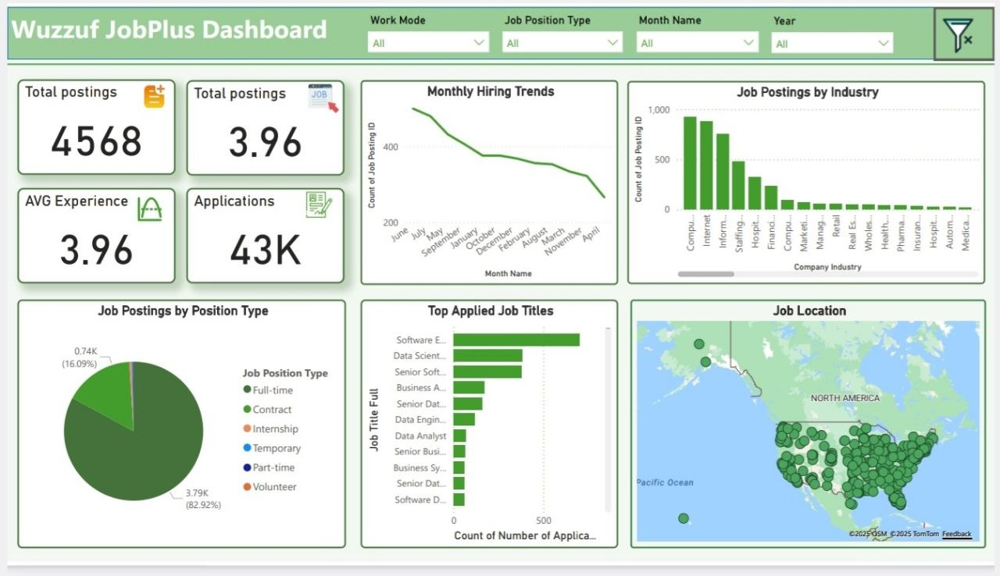

# 📊 JobPulse Dashboard

## Interactive Power BI Dashboard for Job Market Analysis

JobPulse is an interactive Power BI dashboard built using the Wuzzuf Job Postings dataset.

It provides valuable insights into hiring trends, job demand, industries, applications, and locations through interactive visualizations.

---

# 📷 Dashboard Preview

---

# 🎯 Business Problem

Recruiters and job seekers need a simple way to understand hiring trends and explore the job market.

This dashboard transforms raw job posting data into interactive insights that support better decision-making.

---

# 🛠️ Tools

* Power BI
* Power Query
* DAX
* Excel

---

# 📈 Dashboard Features

* Total Job Postings
* Total Applications
* Average Experience
* Monthly Hiring Trend
* Job Industry Analysis
* Job Type Distribution
* Interactive Map
* Top Job Titles

---

# 💡 Key Insights

* Technology companies publish the highest number of vacancies.
* Full-time jobs dominate the market.
* Hiring trends vary by month.
* Interactive filters enable dynamic exploration.

---

# 📂 Repository Files

* JobPulse.pbix
* dashboard.png

---

# 👩‍💻 Author

**Esraa Younis**

Data Analyst
